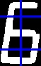
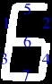
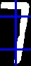
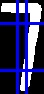

## SSCR - Seven Segment Character Recognition

> Распознаёт символ по пороговому изображению.

### Принцип работы
1) **Recognizer** вырезает из изображения линии пикселей (отмечены синим).

2) Горизонтальные срезы режет на две равных части, вертикальные на три части в соотношении 1:2:1. Каждый от отрезков пересекает один из сегментов.

<div style='width:100%; display: flex; justify-content:center;'>

</div>

3) После этого считает количество подряд идущих пикселей значения которых больше порогового `value >=threshold_value `, для каждого отрезка. Если количество таких пикселей больше или равно минимальному `max_in_row >= number_of_thresholds`, то сегмент пересекаемый этим отрезком имеет код 1, иначе 0.

4) Из кодов отрезков собирается полный код цифры, а по коду находится цифра.

<div style='width:100%; display: flex; justify-content:center;'>

</div>


```python
    digit_codes = {
        "0101000": 1,
        "0110111": 2,
        "0101111": 3,
        "1101010": 4,
        "1001111": 5,
        "1011111": 6,
        "0101100": 7,
        "1111111": 8,
        "1101111": 9,
        "1111101": 0,
    }
```

 5) Цифры сегментных дисплеев имеют наклон, поэтому в случае цифры семь 7-ой код будет 1 хотя это неверно. (рис. 3) Поэтому вместо одного вертикального среза делается два в зонах 40% и 60% от ширины, после подсчёта коды обоих срезов объединяются в один по условию & (0 and 1 == 0).
 

<div style='width:100%; display: flex; justify-content:space-around;'>


</div>

<br>

